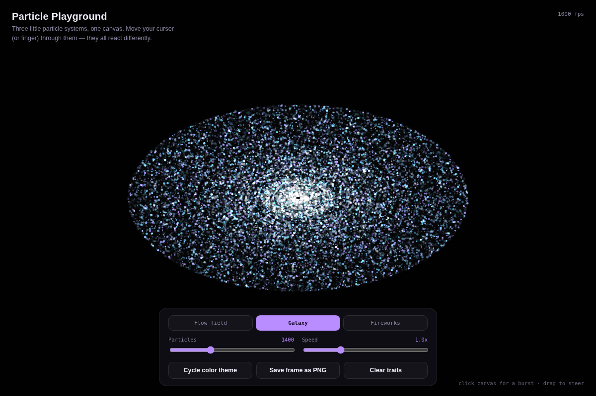

# Particle Playground

Three small particle systems living on one canvas — a noise-driven flow field, an orbiting galaxy, and a fireworks show that launches itself. Move your cursor through any of them and they each react differently.

## Preview



## Modes

- **Flow field** — particles drift along a noise field, your cursor pushes them out of the way as it passes
- **Galaxy** — particles orbit the center on ellipses, faster the closer they are, like real orbital mechanics; cursor perturbs nearby ones
- **Fireworks** — rockets launch on their own and burst into fading color, click anywhere for an extra burst

## Features

- Particle count and speed sliders, live
- 4 color themes, one button cycles through them
- Save the current frame as a PNG
- Click/tap the canvas for a manual burst, drag to steer

## Tech

Vanilla HTML/CSS/JS, all rendered on a single `<canvas>` with `requestAnimationFrame`. No libraries — the "noise" field is just a few layered sin/cos waves, not real Perlin noise, and it reads close enough.

## Why

Wanted something in the portfolio that isn't just functional — this one's just meant to be fun to poke at for a few seconds.

## Run it

```bash
npx serve .
```

## License

MIT

